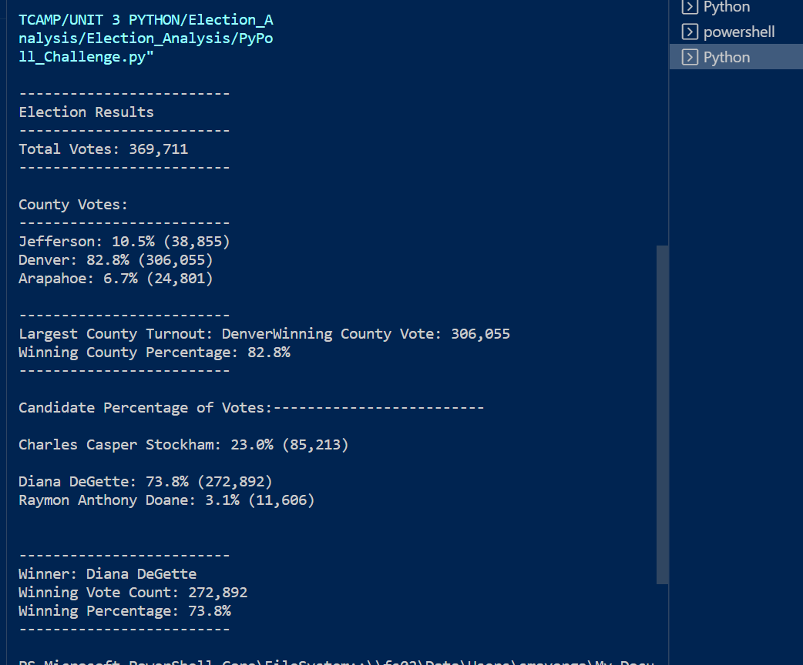
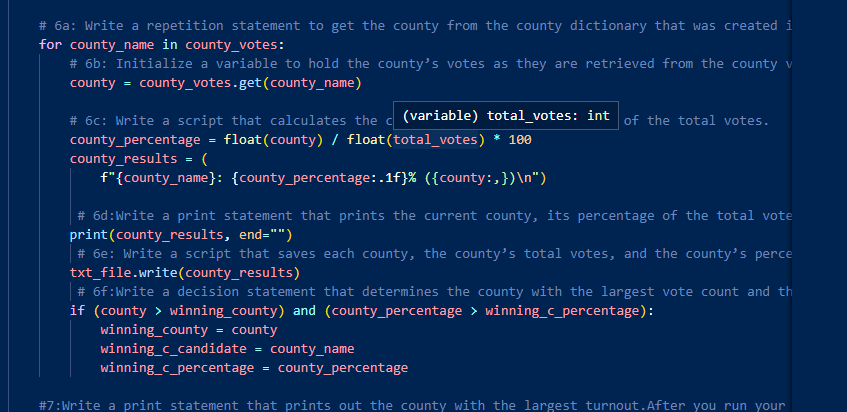
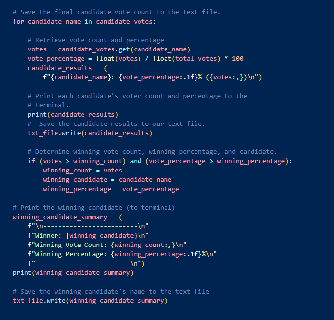

# Election_Analysis (Python challenge)

## Overview of Election Audit
### Purpose
we will assist the Colorado Board of Elections in an Election audit of the tabulated results for a congressional election in the State. The main goal of this audit is to analyze the total overall number of votes and complete a list of candidate who received the votes, the we will get the total number of votes that each candidate got which will lead us to get the percentage that each Candidate won. all of these numbers will give us a clear view of the election winner.
Additionally we will analyze the county turnout, we will run coding that will give us a view od the percentage of votes from each county and we will also see which county had the biggest turnout

## Election-Audit Results

The result of the election shows that a total of 369,711 votes were casted. These votes were divided in 3 counties as followed:
* Jefferson: 10.5% (38,855)
* Denver: 82.8% (306,055)
* Arapahoe: 6.7% (24,801)
showing that Denver had the largest amount of votes with 82.8% of all votes, the coding used to get these numbers is shown below.

One of the most important goeals from this analysis was to see the candidates results, running the conding shown below, we were able to determine the following results:

* Charles Casper Stockham received 23.0% of the vote and 85,213 number of votes.
* Diana DeGette received 73.8% of the vote  and 272,892 number of votes.
* Raymon Anthony Doane 3.1% of the vote and 11,606 number of votes.
### coding

this shows that the winner was Diana DeGette who received 73.8% of the votes and a total of 272,892 votes.

##Election-Audit Summary

The results are clear and shows that the winner was Diana DeGette who received 73.8% of the votes and a total of 272,892 votes and it also show Denver with the biggest turn out with a total of 306,055 votes.

My proposition for future elections are as followed
 * Collect the type of votes (strings) (ballots , electronic, scanned)
    * use the same type of script used to get the counties and Analyze the turnout for each type of vote, as we have seen in past elections, the method of voting affects the results.
 * identify Genders:
    * I would use the same cript but change the strings to Genders, this will show if voters are biased by the Gender of the candiate.
  
      

